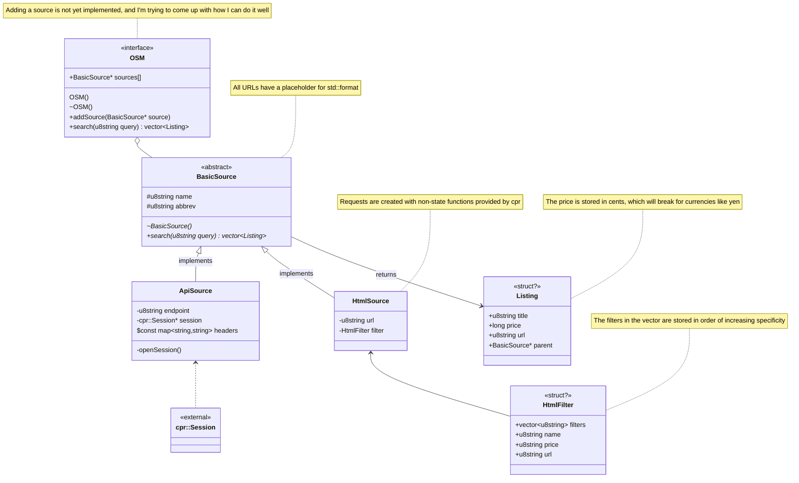

# Library design graph

*Note that all of this happens inside the namespace `libosm`*

```mermaid
classDiagram
    note for OSM "Adding a source is not yet implemented, and I'm trying to come up with how I can do it well"
    class OSM {
        <<interface>>
        +BasicSource* sources[]
        OSM()
        ~OSM()
        +addSource(BasicSource* source)
        +search(u8string query) vector~Listing~
    }
    note for BasicSource "All URLs have a placeholder for std::format"
    class BasicSource { 
        <<abstract>>
        #u8string name
        #u8string abbrev
        ~BasicSource()*
        +search(u8string query) vector~Listing~*

    }
    OSM o-- BasicSource
    class ApiSource {
        -u8string endpoint
        -cpr::Session* session
        $const map~string,string~ headers
        -openSession()
    }
    note for HtmlSource "Requests are created with non-state functions provided by cpr"
    class HtmlSource {
        -u8string url
        -HtmlFilter filter
    }
    class cprs["cpr::Session"]
    <<external>> cprs
    ApiSource <.. cprs
    BasicSource <|-- ApiSource : implements
    BasicSource <|-- HtmlSource : implements
    note for Listing "The price is stored in cents, which will break for currencies like yen"
    class Listing {
        <<struct?>>
        +u8string title
        +long price
        +u8string url
        +BasicSource* parent
    }
    BasicSource --> Listing : returns
    note for HtmlFilter "The filters in the vector are stored in order of increasing specificity"
    class HtmlFilter {
        <<struct?>>
        +vector~u8string~ filters
        +u8string name
        +u8string price
        +u8string url
    }
    HtmlSource <-- HtmlFilter
```
